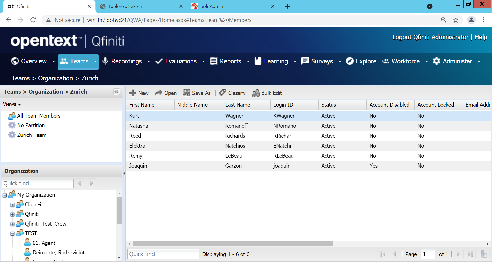
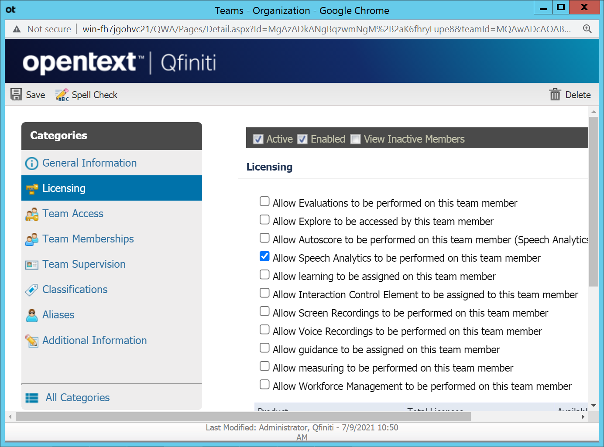

# Tips & tricks


## Qfiniti Call Importer
The **Qfiniti Data Import tool** is used to import recording transactions from etalk Recorder, older versions of Qfiniti, or a 3rd party recording device into Qfiniti. It can also be used to add teams and team members, especially ones associated with those transactions, if those teams and or team members do not already exist in HP Qfiniti.

### Executing Qfiniti Call Importer
The importer can be run as a service or by command line. When run on command line, it is invoked as follows to run one time, immediately.

```
	QfinitiDataImport.exe /runonce
```

### Creating user during the import process
**Qfiniti Data Import** can create users and groups during the import process, you just need to set as `true` the fields `CreateUsers` and `CreateGroups` in the **QfinitiDataImport.exe.config** file:

```xml
	<plugin type="UserLookupPlugin">
		<CacheUsers>true</CacheUsers>
		<CreateUsers>true</CreateUsers>
		<CreateGroups>true</CreateGroups>
		<LoginType>0</LoginType>
		<LoginFormat>
			<field select="login_id" />
		</LoginFormat>
	</plugin>
```

### Assign licenses to users on Qfiniti
If you have created users/groups during the import process you must review `Qfiniti > Teams > Organization` to check if each new user has a transcription license assigned:







